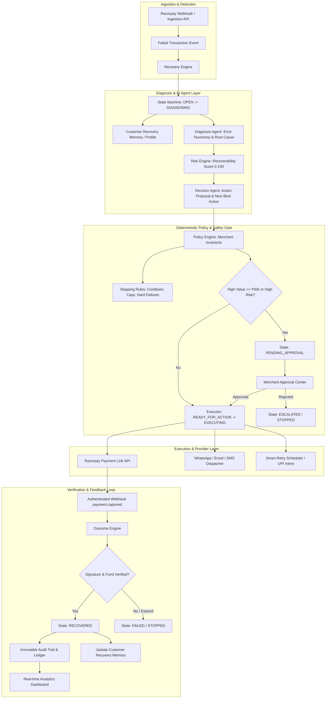

<div align="center">

# REVIVE
### Autonomous AI Revenue Recovery Orchestration

**Built for the Razorpay AI Buildathon — Track 03: AI Revenue Recovery**

[](https://razorpay.com)
[](https://www.python.org/)
[](https://fastapi.tiangolo.com)
[](https://react.dev)
[](https://vitejs.dev)
[](https://tailwindcss.com)
[](LICENSE)

</div>

---

REVIVE replaces dumb, repetitive dunning retries with an intelligent, bounded execution loop:

**Detect → Diagnose → Decide → Guard (Policy & Stopping Rules) → Execute → Verify (Outcome) → Learn → Measure**

## Why REVIVE

- **Bounded autonomy.** AI proposes, policy authorizes, the executor executes, the outcome verifies, and everything gets audited. AI agents never have direct authority to mutate databases, trigger monetary actions without verification, or bypass merchant-configured safety policies.
- **Outcome decoupled from action.** Generating a payment link is not a recovery. A case is only marked `RECOVERED` after an authenticated Razorpay webhook (`payment.captured`, HMAC-SHA256 signed) or a settled API check confirms funds actually landed.
- **Monetary integer precision.** All financial values are stored as 64-bit integer paise (₹4,999.00 = `499900`) — no floating-point ledger corruption.
- **Human-in-the-loop approvals.** Transactions above merchant risk thresholds (e.g. ≥ ₹50,000) or flagged as high-risk automatically pause in `PENDING_APPROVAL` for one-click sign-off.

### Results (1,000-case benchmark vs. baseline)

| Metric | Baseline | REVIVE | Change |
|---|---:|---:|---:|
| Recovery rate | 22.4% | 51.0% | **+127.9%** |
| Blind retries | 1,842 | 114 | **−93.8%** |
| Recovery velocity | 68.4 hrs | 4.2 hrs | **93.9% faster** |
| Policy compliance | — | 100% | 0 spam / opt-out complaints |

---

## System Architecture



---

## Quickstart

### 1. Backend

```bash
git clone https://github.com/your-org/revive.git
cd revive

# Create and activate a virtual environment
python -m venv venv
.\venv\Scripts\Activate.ps1    # Windows PowerShell
# source venv/bin/activate     # Linux / macOS

# Install dependencies
pip install -r backend/requirements.txt

# Seed the database — 1,000 realistic cases across 16 scenarios
python scripts/seed.py

# Start the backend (port 8000)
uvicorn backend.app.main:app --host 127.0.0.1 --port 8000 --reload
```

### 2. Frontend

```bash
cd frontend
npm install
npm run dev -- --port 5173
```

Open **http://localhost:5173**

---

## Guided Demo

Head to the **Guided Demo** tab (`/demo`) in the app to run the three benchmark scenarios:

| Scenario | Amount | Failure Type | Expected Behavior |
|---|---:|---|---|
| **A — Standard Recovery** | ₹4,999 | Soft UPI / insufficient funds | Diagnoses root cause, scores ~82% recoverability, dispatches a Razorpay Payment Link, verifies via webhook → **`RECOVERED`** |
| **B — Approval Gate** | ₹87,000 | High-value enterprise subscription | Policy detects the ≥₹50,000 threshold, blocks autonomous action → **`PENDING_APPROVAL`** in the Approval Center |
| **C — Outage / Hard Decline** | ₹12,500 | Stolen card / hard bank decline | Stopping Rules detect a terminal decline, quarantine retries → **`STOPPED`** |

---

## Testing

```bash
# Full test suite
pytest backend/tests/ -v

# Comparative benchmark
python scripts/run_evaluation.py
```

---

## Documentation

| Doc | Covers |
|---|---|
| [System Architecture](docs/architecture.md) | Full architecture, state machine spec, ERV formulation, bounded autonomy model |
| [Product Specification](docs/product.md) | Problem statement, personas, value pillars, ROI analysis |
| [Evaluation Methodology](docs/evaluation.md) | Benchmark methodology, baseline comparisons, statistical proofs |
| [Razorpay Integration Guide](docs/razorpay-integration.md) | Payment Link APIs, HMAC-SHA256 verification, sim/live modes |
| [Judge Demo Script](docs/demo-script.md) | Step-by-step walkthrough for evaluators |
| [Design System](docs/design-system.md) | Typography, semantic color palette, UI tokens |
| [Engineering Decisions (ADRs)](docs/engineering-decisions.md) | Key architectural choices |

---

## Project Layout
