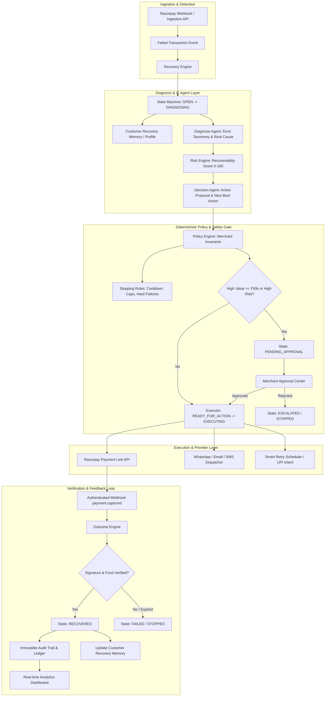

# REVIVE — Autonomous AI Revenue Recovery Orchestration

[](https://razorpay.com)
[](https://www.python.org/)
[](https://fastapi.tiangolo.com)
[](https://react.dev)
[](https://vitejs.dev)
[](https://tailwindcss.com)
[](LICENSE)

> **REVIVE** is an autonomous revenue recovery orchestration layer built for the **Razorpay AI Buildathon (Track 03: AI Revenue Recovery)**.
> It replaces dumb, repetitive dunning retries with an intelligent, bounded execution loop:
> **Detect $\to$ Diagnose $\to$ Decide $\to$ Guard (Policy & Stopping Rules) $\to$ Execute $\to$ Verify (Outcome) $\to$ Learn $\to$ Measure**.

---

## 🚀 Key Highlights & Differentiators

1. **Bounded Autonomy Philosophy**:
   $$\text{AI Proposes} \longrightarrow \text{Policy Authorizes} \longrightarrow \text{Executor Executes} \longrightarrow \text{Outcome Verifies} \longrightarrow \text{Audit Records}$$
   AI agents **never** have direct authority to mutate databases, trigger monetary actions without verification, or bypass merchant-configured safety policies.
2. **Outcome Decoupled from Action Execution**:
   Generating a payment link is **not** a recovery. A case is marked `RECOVERED` only after an authenticated Razorpay webhook (`payment.captured` with HMAC-SHA256 signature) or settled API verification confirms funds.
3. **Monetary Integer Precision**:
   All financial values are strictly represented in 64-bit integer paise (₹4,999.00 = `499900`), completely eliminating floating-point ledger corruption.
4. **Human-in-the-Loop Approval Center**:
   Transactions exceeding merchant risk thresholds (e.g., $\ge$ ₹50,000) or high-risk profiles automatically pause in `PENDING_APPROVAL` for one-click human sign-off.
5. **Demonstrated Scientific Lift**:
   Empirically verified against an identical 1,000-case dataset:
   - **+127.9% Recovery Rate Lift** (51.0% vs 22.4% baseline)
   - **-93.8% Reduction in Blind Retries** (114 vs 1,842 retries)
   - **93.9% Faster Recovery Velocity** (4.2 hrs vs 68.4 hrs)
   - **100% Policy Compliance** (0 customer spam/opt-out complaints)

---

## 🏛️ System Architecture



---

## ⚡ 60-Second Quickstart

### 1. Clone & Set Up Backend

```bash
# Clone the repository
git clone https://github.com/your-org/revive.git
cd revive

# Create and activate virtual environment
python -m venv venv
.\venv\Scripts\Activate.ps1    # On Windows PowerShell
# source venv/bin/activate     # On Linux / macOS

# Install backend dependencies
pip install -r backend/requirements.txt

# Populate database with 1,000 realistic cases across 16 scenarios
python scripts/seed.py

# Start backend server (port 8000)
uvicorn backend.app.main:app --host 127.0.0.1 --port 8000 --reload
```

### 2. Set Up & Launch Frontend

```bash
# In a separate terminal
cd frontend

# Install dependencies (already prepared)
npm install

# Start Vite dev server (port 5173)
npm run dev -- --port 5173
```

Open your browser to: **`http://localhost:5173`**

---

## 🎬 Guided Evaluation Demo (3 Core Scenarios)

Navigate to the **Guided Demo** tab (`/demo`) in the web application to test the three benchmark cases:

| Scenario | Amount | Failure Type | Expected System Behavior |
| :--- | :---: | :--- | :--- |
| **Case A: Standard Recovery** | ₹4,999 | Soft UPI / Insufficient Funds | Diagnoses root cause, calculates ~82% recoverability score, dispatches interactive Razorpay Payment Link, verifies payment webhook $\to$ **`RECOVERED`**. |
| **Case B: Approval Gate** | ₹87,000 | High-Value Enterprise Subscription | Policy detects amount $\ge$ ₹50,000 threshold $\to$ Autonomous action **blocked** $\to$ Pauses in **`PENDING_APPROVAL`**. Appears in Approval Center for one-click human sign-off. |
| **Case C: Outage / Hard Decline** | ₹12,500 | Stolen Card / Hard Bank Decline | Stopping Rules detect terminal decline $\to$ Quarantines retries to protect customer trust $\to$ Transitions directly to **`STOPPED`**. |

---

## 🧪 Automated Testing & Verification

Run the comprehensive pytest suite covering state machine invariants, policy guardrails, outcome verification, and API endpoints:

```bash
# Run all tests
pytest backend/tests/ -v

# Run the comparative benchmark
python scripts/run_evaluation.py
```

---

## 📚 Complete Technical Documentation

- **[System Architecture](docs/architecture.md)**: Full architecture, state machine specification, ERV formulation, and bounded autonomy model.
- **[Product Specification](docs/product.md)**: Problem statement, target personas, core value pillars, and ROI analysis.
- **[Evaluation Methodology](docs/evaluation.md)**: Scientific benchmark methodology, baseline comparisons, and statistical proofs.
- **[Razorpay Integration Guide](docs/razorpay-integration.md)**: Payment Link APIs, HMAC-SHA256 signature verification, and dual simulation/live modes.
- **[Judge Demo Script](docs/demo-script.md)**: Step-by-step interactive walkthrough for evaluators and judges.
- **[Design System](docs/design-system.md)**: Anti-AI slop philosophy, typography, semantic color palette, and reusable UI tokens.
- **[Architectural Decision Records (ADRs)](docs/engineering-decisions.md)**: Key engineering choices, monetary integers, state machines, and dual database design.

---

## 📦 Project Layout

```
REVIVE/
├── backend/
│   ├── app/
│   │   ├── agents/          # AI Diagnosis, Decision & Explanation agents
│   │   ├── api/             # REST API routers (dashboard, recovery, approvals, demo, webhooks)
│   │   ├── core/            # Config, security, logging, exceptions
│   │   ├── database/        # SQLAlchemy session & Base
│   │   ├── engine/          # State machine, Risk, Policy, Stopping Rules & Outcome engines
│   │   ├── models/          # 11 SQLAlchemy 2.0 database models
│   │   ├── schemas/         # Pydantic v2 validation schemas
│   │   ├── services/        # Razorpay integration, AI providers, simulation & evaluation
│   │   └── utils/           # Money arithmetic (paise), enums, timestamps
│   ├── tests/               # Pytest unit, safety and integration test suite
│   └── requirements.txt     # Backend Python dependencies
├── frontend/
│   ├── src/
│   │   ├── api/             # Typed API client
│   │   ├── components/      # StatusBadge, MetricCard, EmptyState, LoadingSkeleton
│   │   ├── layouts/         # AppLayout, Sidebar, Header
│   │   ├── pages/           # 10 full-featured dashboard & management pages
│   │   ├── types/           # Complete TypeScript interface definitions
│   │   ├── utils/           # Monetary and date formatting utilities
│   │   ├── App.tsx          # Router and React Query provider
│   │   └── main.tsx         # Application entry point
│   ├── package.json
│   ├── tailwind.config.js   # Fintech design tokens
│   └── vite.config.ts       # Vite config with API proxy
├── docs/                    # Complete 7-part engineering documentation suite
├── scripts/
│   ├── seed.py              # Generates 1,000 realistic cases across 16 scenarios
│   ├── demo.py              # CLI demonstration of Cases A, B, and C
│   └── run_evaluation.py    # Headless benchmark comparing REVIVE vs Baseline
├── docker-compose.yml       # Production container orchestration
└── README.md                # Project documentation root
```

---

## 🛡️ Security & Compliance

- **HMAC-SHA256 Webhook Verification**: Rejects unauthenticated or tampered webhook callbacks.
- **Data Isolation**: Strict merchant scoping prevents cross-tenant data leakage.
- **Immutable Audit Trail**: All state transitions, AI diagnostic rationales, operator approvals, and monetary settlements are permanently logged.
- **Zero Hallucination Guard**: Deterministic policy engines override LLM proposals whenever safety thresholds are reached.

---

## 👥 Built for Razorpay AI Buildathon 2026 — Track 03: AI Revenue Recovery
Designed, architected, and engineered for resilience, financial precision, and measurable ROI.
# REVIVE

# REVIVE

