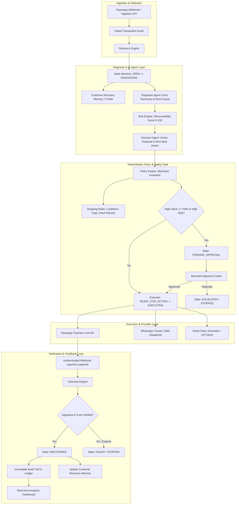
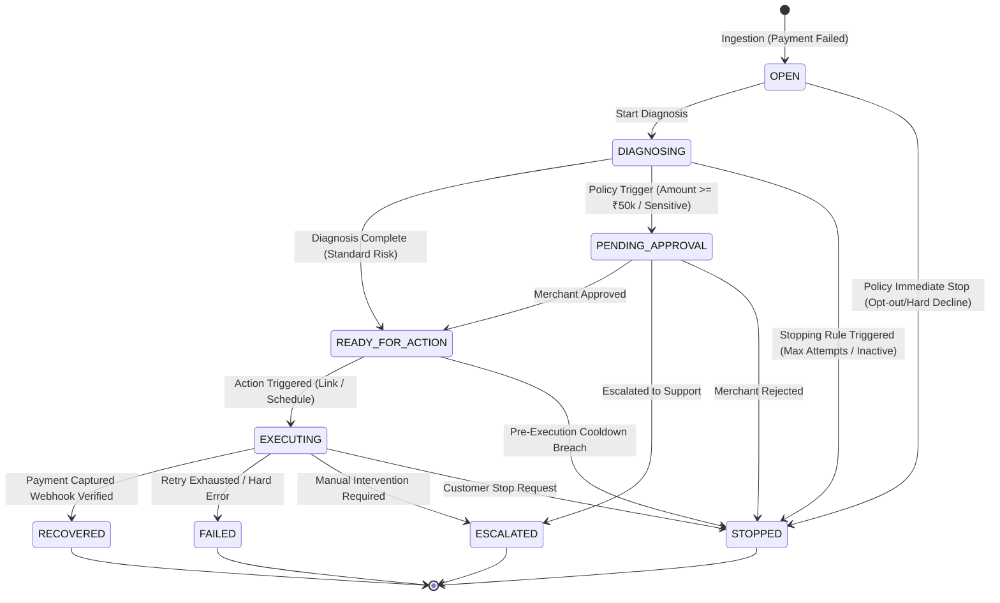

# REVIVE — System Architecture & Engineering Specification

## 1. Executive Architecture Summary

REVIVE is an autonomous revenue recovery orchestration system designed for the Razorpay AI Buildathon (Track 03). Rather than relying on static rules or unconstrained LLMs, REVIVE enforces a **bounded autonomy model**:

$$\text{AI Proposes} \longrightarrow \text{Policy Authorizes} \longrightarrow \text{Executor Executes} \longrightarrow \text{Outcome Verifies} \longrightarrow \text{Audit Records} \longrightarrow \text{Metrics Measure}$$

At no point in the lifecycle does an AI agent possess the authorization to mutate databases directly, trigger monetary transactions without validation, or bypass merchant-configured safety invariants.

---

## 2. Core Architectural Principles

1. **Deterministic State Machine**: Every recovery case transitions through explicit, mathematically validated state boundaries (`OPEN` $\to$ `DIAGNOSING` $\to$ `READY_FOR_ACTION` $\to$ `EXECUTING` $\to$ `RECOVERED`/`FAILED`/`ESCALATED`/`STOPPED`). Bypassing intermediate states is blocked at the database and application levels.
2. **Outcome Decoupling**: Executing an action (e.g., dispatching a Razorpay Payment Link) is fundamentally decoupled from marking revenue as recovered. A case reaches `RECOVERED` status **only** after an authenticated Razorpay webhook (`payment.captured` with valid HMAC-SHA256 signature) or an explicit API fetch confirms funds settlement.
3. **Monetary Integer Arithmetic**: Floating-point math is strictly forbidden. All transaction values, fees, recovery amounts, and thresholds are stored as 64-bit integers in minor units (paise: ₹4,999.00 = `499900`).
4. **Explainable Recoverability Scoring**: The Risk Engine computes a continuous recoverability score ($0 \le S \le 100$) alongside positive and negative contributing factors, providing complete human transparency.
5. **Human-in-the-Loop Thresholds**: Transactions exceeding merchant risk thresholds (e.g., amount $\ge$ ₹50,000 or customer opt-out risk) trigger mandatory human review in the **Approval Center** before execution can proceed.

---

## 3. High-Level System Architecture Diagram

---

## 4. State Machine Specification

The state machine is implemented in `backend/app/engine/state_machine.py` and strictly enforces legal lifecycle transitions:

### Transition Table

| Source State | Target State | Trigger Condition | Enforcement Mechanism |
| :--- | :--- | :--- | :--- |
| `OPEN` | `DIAGNOSING` | Engine loop acquires case | `StateMachine.transition()` validation |
| `DIAGNOSING` | `READY_FOR_ACTION` | AI & Risk engines complete; Policy permits auto-execution | State check + Audit log entry |
| `DIAGNOSING` | `PENDING_APPROVAL` | Amount $\ge$ `approval_threshold_paise` or high-risk profile | Policy Engine rule evaluation |
| `PENDING_APPROVAL`| `READY_FOR_ACTION` | Merchant operator clicks "Approve" | Operator signature recorded in audit |
| `PENDING_APPROVAL`| `STOPPED` | Merchant operator clicks "Reject" | Stopping reason logged |
| `READY_FOR_ACTION`| `EXECUTING` | Action dispatcher invokes channel (Razorpay link, UPI, etc.) | Idempotency key verified |
| `EXECUTING` | `RECOVERED` | Webhook verified or API poll confirms `captured` | Outcome Engine financial verification |
| `EXECUTING` | `FAILED` | Terminal error code or retry limit reached | Max retries policy check |

---

## 5. Bounded Autonomy & Safety Architecture

### Separations of Authority

| Responsibility | AI Layer (Agents) | Policy Engine | Execution Engine |
| :--- | :---: | :---: | :---: |
| Propose recovery strategy | ✅ **YES** | ❌ No | ❌ No |
| Authorize monetary transactions | ❌ **FORBIDDEN** | ✅ **YES** | ❌ No |
| Enforce retry & contact limits | ❌ **FORBIDDEN** | ✅ **YES** | ❌ No |
| Mutate database records directly| ❌ **FORBIDDEN** | ❌ No | ✅ **YES** |
| Dispatch network calls | ❌ **FORBIDDEN** | ❌ No | ✅ **YES** |
| Mark revenue as recovered | ❌ **FORBIDDEN** | ❌ No | ❌ No (Outcome Engine only) |

### Stopping Invariants

The `StoppingRulesEngine` (`backend/app/engine/stopping_rules.py`) evaluates safety rules before every action:

1. **Max Retry Ceiling**: Never exceed merchant-configured retries (default: 4).
2. **Customer Contact Ceiling**: Maximum communications per 24 hours (default: 2) to prevent harassment.
3. **Hard Decline Quarantine**: Immediate permanent halt on stolen cards, fraudulent accounts, or closed banks (`do_not_honor`, `stolen_card`, `account_closed`).
4. **Mandatory Cooldown Period**: Minimum 4-hour delay between automated payment retries to respect banking batch cycles.
5. **Customer Opt-Out**: Immediate halt if customer requests unsubscription or dispute.

---

## 6. Expected Recovery Value (ERV) Algorithm

Prioritization is calculated deterministically via the Expected Recovery Value formula:

$$\text{ERV} = (P_{\text{recover}} \times \text{Amount}) - \text{Action Cost}$$

Where:
- $P_{\text{recover}} \in [0.0, 1.0]$ is the calibrated recoverability probability derived from the Risk Engine score.
- $\text{Amount}$ is the transaction value in paise.
- $\text{Action Cost}$ is the estimated marginal cost of the intervention (e.g., SMS cost: ₹0.20, WhatsApp: ₹0.80, Razorpay platform link fee: ₹0.00).

Cases are sorted into prioritized queues based on ERV descending, ensuring merchant recovery teams maximize net recovered revenue per minute invested.
